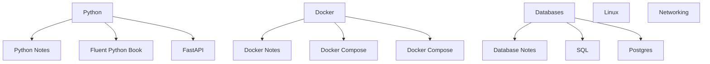

# Notebook

Personal notebook in markdown files format for structuring knowledge and useful
commands. Document will include technical explanation of concepts associated with
software development, system administration, and networking.

## Table of Contents

- [Python Notes](doc/python.md#python-notes)
- [Docker Notes](doc/docker.md#docker-notes)
- [Git Notes](doc/git.md#git-notes)

## Technical Stack

